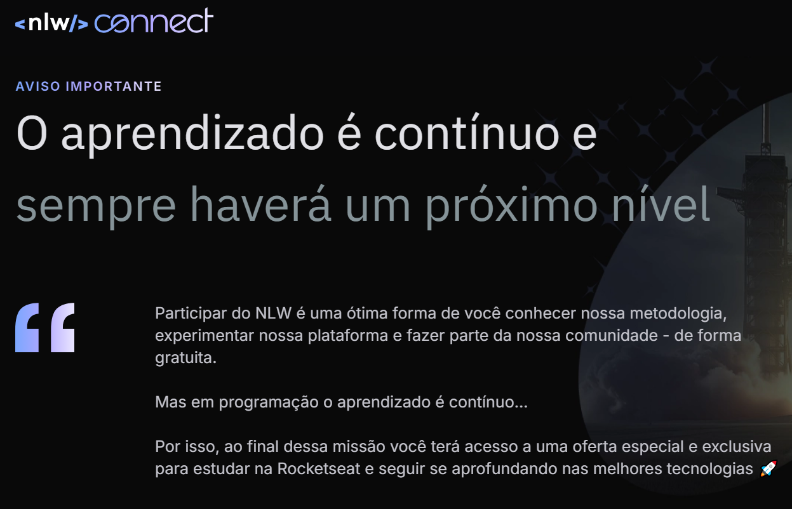

# 🚀 NLW Connect - Trilha Java

Este repositório contém os aprendizados e a aplicação desenvolvida durante o evento **NLW Connect**, promovido pela **Rocketseat**.

## 📌 Sobre o NLW

O **Next Level Week (NLW)** é uma experiência imersiva de uma semana, repleta de **código, desafios e networking**, proporcionando uma oportunidade única para aprendizado prático e evolução na carreira de desenvolvimento.

## 🖥️ Trilha Java com Spring Boot

Na trilha de **Java**, conduzida pelo professor **Isidro**, desenvolvemos uma aplicação completa para **inscrição em eventos**, explorando conceitos fundamentais do **ecossistema Java e Spring Boot**.

## 🔧 Tecnologias Utilizadas

- **Java**
- **Spring Boot**
- **Spring Initializr**
- **MySQL**

## 📚 O que foi desenvolvido?

- Configuração do ambiente de desenvolvimento.
- Utilização do **Spring Initializr** para estruturar o projeto.
- Integração com o banco de dados **MySQL**.
- Implementação de funcionalidades como:
  - **Cadastro e recuperação de eventos** (por ID e URL).
  - **Modelagem de entidades** para inscrição de usuários.
  - **Validação de regras de negócio**.
  - **Geração de relatórios**, incluindo:
    - Número de inscritos.
    - Inscrições por indicação.
    - Ranking de usuários.
      
## Foi uma experiência incrível, que me permitiu aprofundar meus conhecimentos e evoluir como desenvolvedor! 🚀

